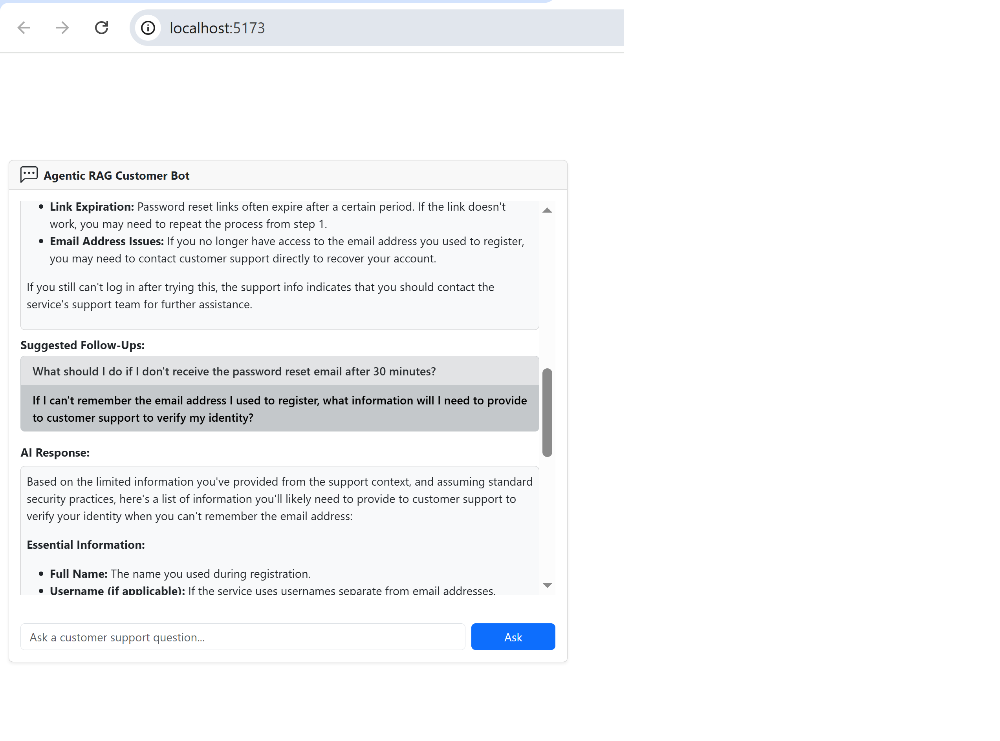
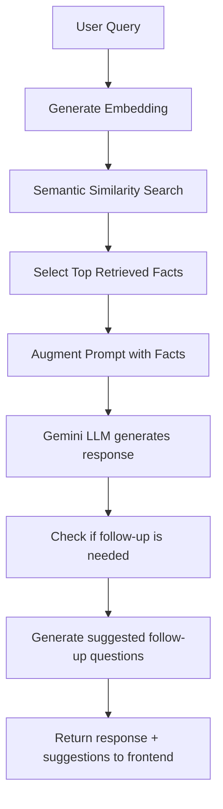

# 🤖 Agentic CustomerBot

This is a full-stack **Agentic RAG-style Customer Support Bot** built with:

- **Frontend:** React 19 + React Bootstrap
- **Backend:** Node.js + Express + LangChain + Gemini API
- **LLM Model:** Gemini 2.0 Flash
- **Embeddings:** Gemini `embedding-001`
- **Retrieval:** Semantic search using cosine similarity
- **Agentic Features:** 
  - Auto-suggested follow-up prompts
  - Context-aware multi-turn interaction
  - Markdown rendering and chatbot UI

---

## 🧠 What Makes It Agentic?

Unlike simple FAQ bots, this implementation does:
- Semantic retrieval instead of keyword search
- Planning next steps using LLM suggestions
- Multi-turn, contextual follow-ups
- Human-like Markdown-formatted replies

---

## 📷 Sample UI



---

## 📂 Project Structure

```
agentic_customer_bot/
│
├── agentic_customer_bot_server/
│   ├── data/
│   │   └── faq.txt
│   ├── utils/
│   │   └── cosineSimilarity.js
│   ├── screenshots/
│   │   └── sample-ui.png
│   ├── agenticCustomerBot.js       # Main Express backend
│   └── .env                        # Contains your GEMINI_API_KEY
│
└── react-agentic-client/
    ├── src/
    │   ├── components/
    │   │   └── ChatInterface.jsx
    │   └── App.jsx
    └── package.json
```

---

## 🚀 Getting Started

### 1. Clone the Repo

```bash
git clone https://github.com/your-org/agentic-customerbot.git
cd agentic-customerbot
```

### 2. Set Up the Backend

```bash
cd agentic_customer_bot_server
npm install
cp .env.example .env  # Add your Gemini API key
node agenticCustomerBot.js
```

### 3. Set Up the Frontend

```bash
cd ../react-agentic-client
npm install
npm run dev
```

- Backend: `http://localhost:5000`
- Frontend: `http://localhost:5173`

---

## 🔁 Backend Flowchart



---

## 📘 Tech Stack

| Layer    | Tech                           |
|----------|--------------------------------|
| UI       | React 19, Bootstrap            |
| Backend  | Node.js, Express, LangChain    |
| Embedding| Gemini `embedding-001`         |
| LLM      | Gemini 2.0 Flash               |
| Retrieval| Cosine Similarity              |

---

## ✅ Features Recap

- Ask customer service questions
- Auto-retrieve top relevant support info
- Generate detailed LLM answers
- Get multiple intelligent follow-up prompts
- Markdown rendering for clear formatting

---

## 💡 Inspired By

This project expands on a simpler [Agentic RAG example](https://github.com/your-org/agentic-rag-demo), showing how to evolve into a real customer support agent.

